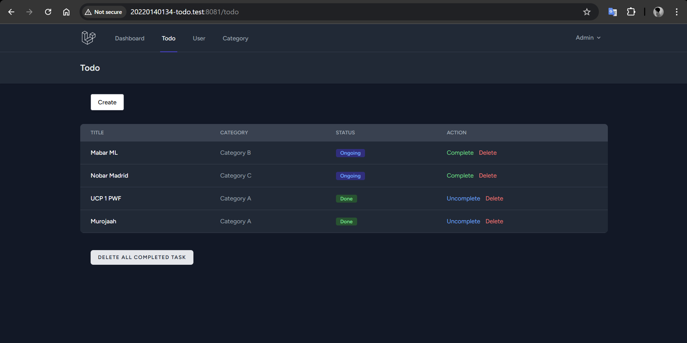
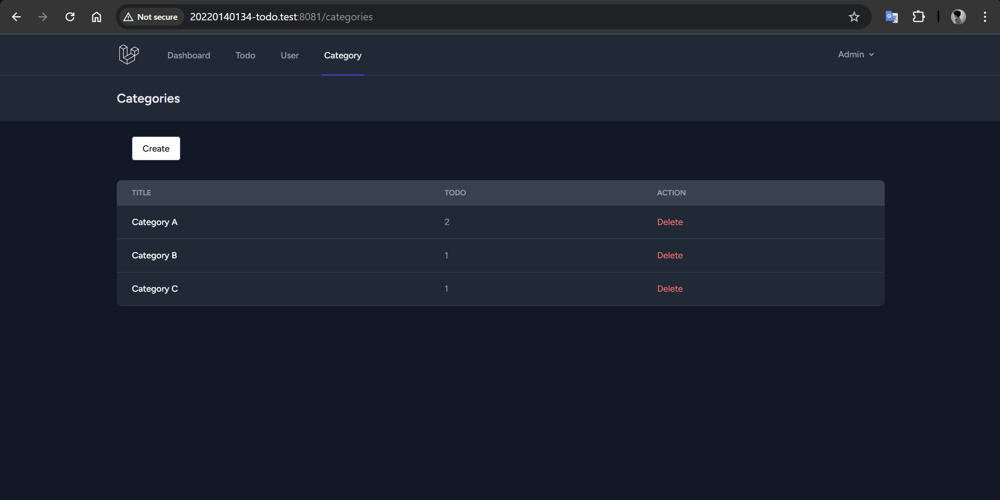
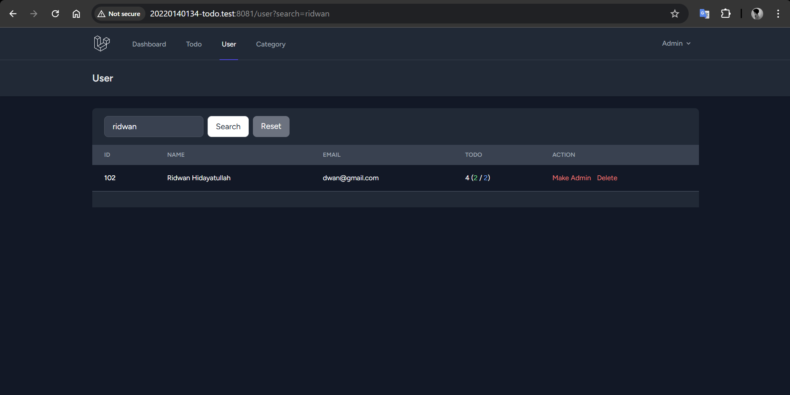
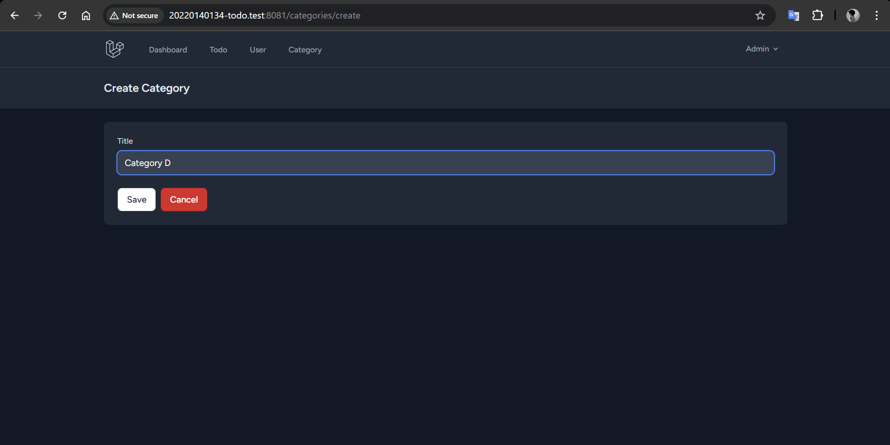
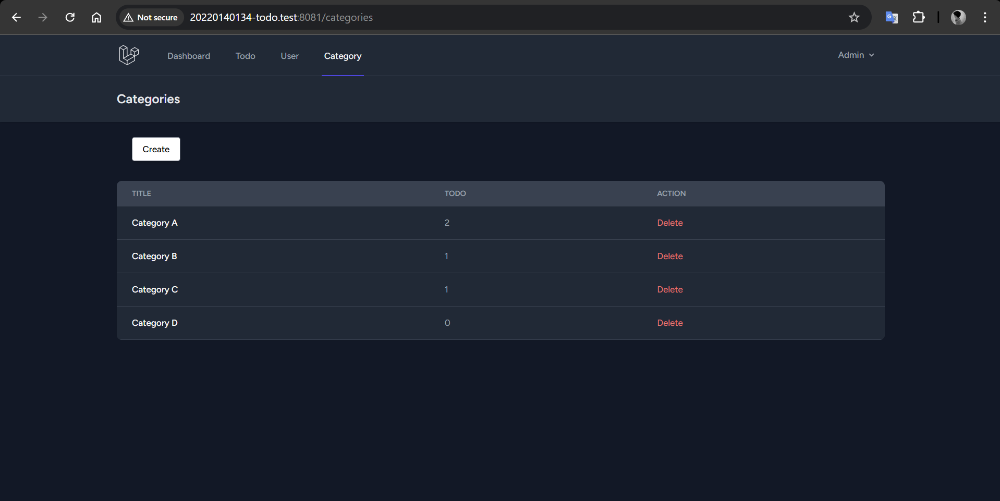
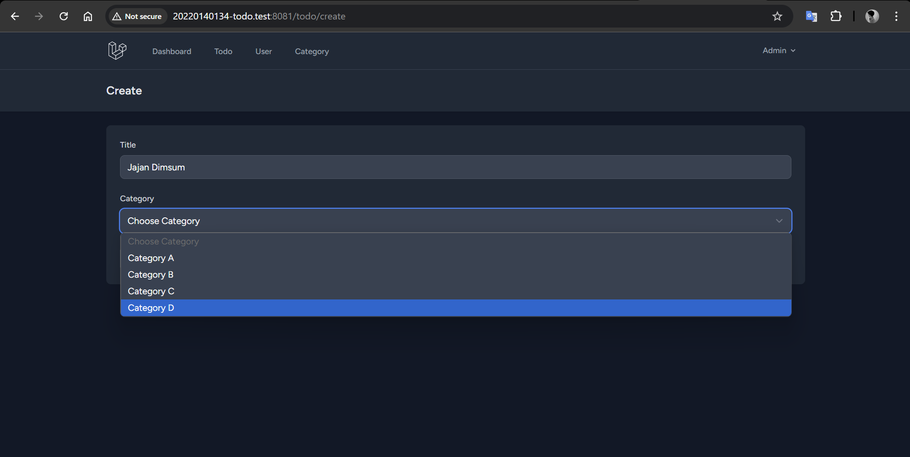
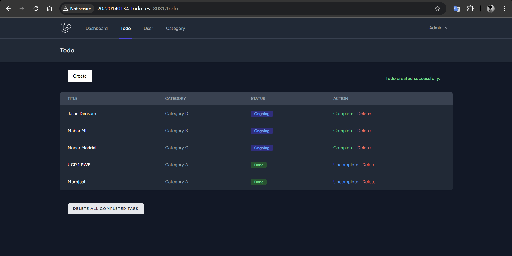
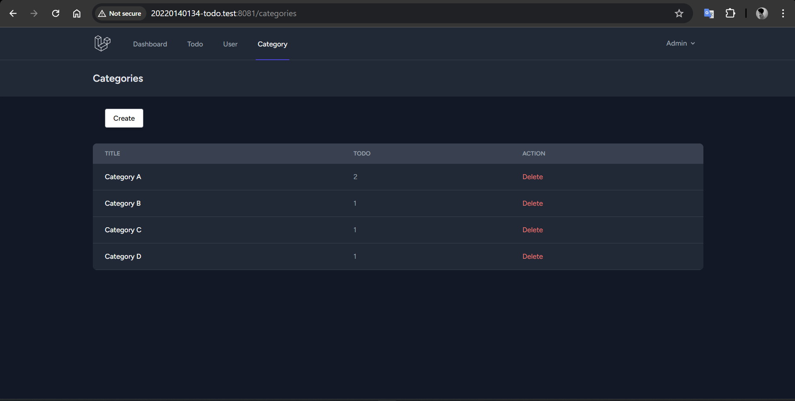

# UCP 1

## 1. Browser Todo

## 2. Browser Category

## 3. Browser User

## 4. Create Category

## 5. After Create Category

## 6. Create Todo with Category

## 7. After Create Todo with Category

## 8. Updated Category
